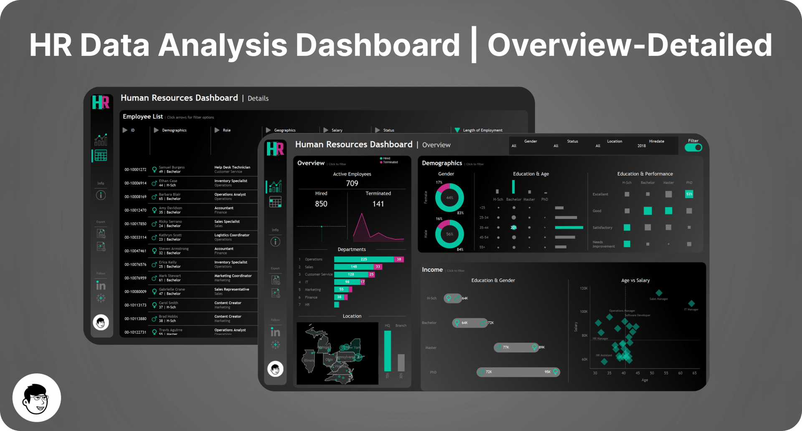

# HR Data Analysis Dashboard

**Tools:** Tableau, Python (pandas, Faker), ChatGPT, Figma | **Skills:** dashboard design, synthetic data generation, analytical thinking

## The question

What would an HR manager actually need to see? A quick summary of the workforce, and enough detail to look up one specific employee. I wanted to build that dashboard but had no real HR data, so the first job was creating a dataset that looks like a real HR system export.

## The data

8,950 synthetic employee records generated with a ChatGPT-written Python script and Faker: demographics, location, department and job title, education, salary, performance rating, overtime, hire dates and terminations. See [`data/`](data/).

## Approach

- **Start from the user.** I decided what an HR manager needs before opening Tableau: a summary view, and a detailed view for individual employees.
- **Generate data that behaves like HR data.** The script ties job titles to departments, education to job titles, salary ranges to job titles, and applies set probabilities to gender, hiring years, performance ratings, overtime and terminations.
- **Summary dashboard in three parts.**
  - Overview: total hired, active and terminated, hiring and termination trends, headcount by department and job title, and headquarters versus branches.
  - Demographics: gender ratio, age distribution, education levels, and education versus performance rating.
  - Income analysis: salary by education level and gender, and age versus salary within each department.
- **Employee list dashboard.** The full list of records with filters across every column, for finding one person and seeing all their details.

Workbook notes: [`analysis/`](analysis/). Screenshots: [`output/`](output/).

## What I found

Because the data is synthetic, the patterns in the dashboard mostly reflect settings in the generator. That is the most useful thing to know when reading it.

- **The workforce is shaped by design.** Operations (30%), Sales (21%), Customer Service (19%) and IT (15%) make up most of the headcount, and 70% of employees are in New York. About 11.2% of employees (1,000) are terminated, with 2021 the heaviest year.
- **Education and performance should not correlate, and they don't by construction.** Performance rating is assigned independently of education, so any apparent relationship in the Demographics view is noise.
- **The pay gap is planted.** The script gives men a 3% (High School) and 11.5% (Bachelor) uplift and women 7% (Master) and 17% (PhD), plus a small age increment. The Income analysis view is built to surface a gap like this, and here its direction flips by education level.
- **The useful result is the dashboard design.** A summary for patterns and a searchable list for individuals cover the two ways an HR manager actually works.

## Design note

A real HR dashboard would sit on a source system (an HRIS) rather than a generated file, and would need access controls: salary, birthdate and performance data are sensitive. Here everything is public because nothing is real.

## Takeaway

Design for the person using it before touching the tool. Deciding what an HR manager needs to see first made the dashboard structure obvious, and the data generator only had to support that.

## Limitations

- The data is entirely synthetic, so nothing here says anything about real workforces.
- The generator has known quirks (the manager age rule never applies, birthdates are not tied to hire dates, terminations bunch up after the 6-month rule, employee IDs are not checked for uniqueness). They are listed in [`data/README.md`](data/README.md).
- The workbook and screenshots are not in this repo yet; add them to `analysis/` and `output/`.

---
*If you find any errors, feel free to email me at [sushant.kr.jha02@gmail.com](mailto:@sushant.kr.jha02@gmail.com).*
