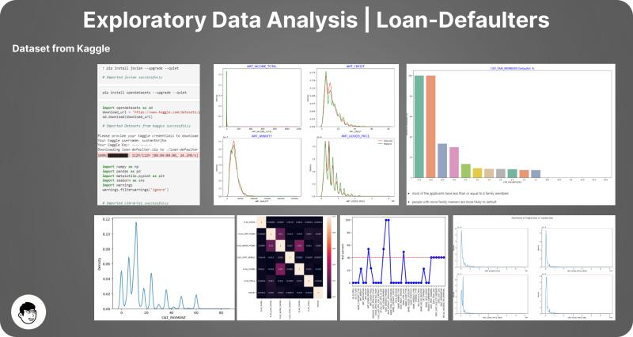

# Bank Loan Defaulter Analysis

Exploratory data analysis on 307,511 bank loan applications to find out what separates applicants who default from those who repay.

**Stack:** Python, Pandas, NumPy, Matplotlib, Seaborn
**Notebook:** [`analysis/loan_defaulter_EDA.ipynb`](analysis/loan_defaulter_EDA.ipynb)



## The question

Which applicant and loan characteristics are associated with defaulting, and how can a lender use them to sharpen its default-risk assessment?

## The approach

1. **Audit missing data.** Checked null percentage per column; 49 application columns had more than 40% nulls.
2. **Drop columns that don't help.** Removed high-null columns and ones with near-zero correlation to `TARGET` (external-source scores, most document flags, contact-detail flags).
3. **Standardise.** Converted negative day counts (age, employment) into years and binned numeric columns (age, income, credit, employment length) into ranges.
4. **Treat nulls by data type.** Chose mean, median, mode, or a new "Unknown" category based on the NOIR level of measurement and the skew/outliers of each column, rather than one blanket rule.
5. **Check outliers** with boxplots before imputing or comparing groups.
6. **Analyse.** Univariate default rates by category, then numeric distributions and correlations for defaulters vs repayers.

## What I found

More than 90% of applicants repay, so the data is heavily imbalanced and default rates are small percentages.

**Who defaults more**
- **Income type:** Maternity leave (~40%) and Unemployed (~37%) are far above the ~10% norm. Students and businessmen had no defaults in the data (small groups).
- **Occupation:** Low-skill laborers are highest (above 17%); drivers, waiters/barmen, security and cooking staff are around 11%.
- **Age and tenure:** Ages 20-40 default more; over 50 is lower. Default rate falls steadily with years employed, from ~10% at 0-5 years to under 1% at 40+.
- **Housing and family:** Renting (>12%) and living with parents (~11.5%) are higher than owning. Civil marriage and single are around 10%, widowed is lowest. Default rises with family size and child count (more than 4 children is very high; tiny groups hit 100%).
- **Region rating:** Rating 3 is highest (11%), rating 1 lowest.
- **Contract and gender:** Cash loans default more than revolving loans; men (~10%) more than women (~7%).
- **Education:** Lower secondary is highest (11%); academic degree is under 2%.
- **Loan size and income:** Credit of 300-600k and income under 300k carry higher default rates; income above 700k is lower.

**What doesn't matter much**
- Owning a car or real estate barely moves the default rate (~8% either way).
- Defaulters and repayers overlap heavily on credit amount, annuity, goods price and income, so none of these works as a standalone predictor.
- Among both groups, credit amount is strongly correlated with goods price and annuity.

**Takeaway:** No single variable separates defaulters cleanly. Risk shows up in combinations of income stability, occupation, age/tenure, and household size, which points toward a multivariate model as the next step.

## Limitations

- Observational EDA only; associations are not causal.
- Several of the extreme rates (100% default, ~0% default) come from very small groups.
- No predictive model is built here.

## Project structure

```
loan-defaulter-eda/
├── README.md      the question, the approach, what I found
├── data/          where to get the Kaggle source files
├── analysis/      Jupyter notebook
└── output/        overview image of the key plots
```

## Resources

This was a learning project. Concepts came from the [Code Basics](https://www.youtube.com/@codebasics) and [Tech Classes](https://www.youtube.com/@techclasses0810) YouTube channels. ChatGPT and the [Denigma Code Explainer](https://denigma.app/) helped explain code, and several cells in the notebook carry step-by-step explanations.

Data: [Kaggle - Loan Defaulter](https://www.kaggle.com/datasets/gauravduttakiit/loan-defaulter)

---
*If you find any errors, feel free to email me at [sushant.kr.jha02@gmail.com](mailto:@sushant.kr.jha02@gmail.com).*
