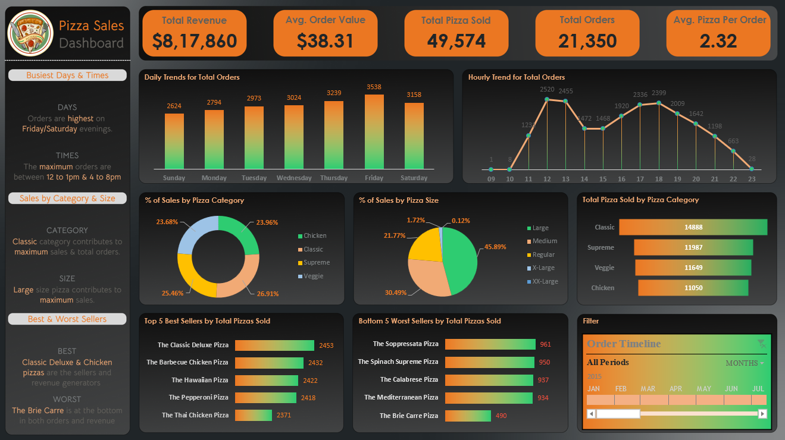

# Pizza Sales Analysis | MySQL + Excel

**Tools:** MySQL, Excel (PivotTables, slicers, dashboard), Figma (dashboard background and layout)
**Published:** July 19, 2024
**Skills:** analytical approach, writing and editing



## The question

Can raw order data be turned into something a stakeholder would actually want to read? Specifically: which pizzas carry the business, which are dead weight, and when do customers actually order?

## The data

A pizza sales dataset from Kaggle: four CSVs covering one year (2015) of orders. None of it is particularly clean, and all of it is waiting for the right questions.

| File | What it holds |
|---|---|
| `orders.csv` | order_id, date, time |
| `order_details.csv` | order_details_id, order_id, pizza_id, quantity |
| `pizza_types.csv` | pizza_type_id, name, category, ingredients |
| `pizzas.csv` | pizza_id, pizza_type_id, size, price |

Source and loading notes are in [`data/README.md`](data/README.md).

## The approach

1. **Get the foundations right.** Total revenue, average order value, total pizzas sold, total orders and average pizzas per order. Half the work in any analysis is making sure these numbers aren't quietly wrong before you build on them.
2. **Ask 23 questions in SQL.** Mostly joins and aggregations, plus CTEs and window functions (`RANK`, running totals) for the percentage-of-total, cumulative revenue and top-N-per-category questions. See [`analysis/questions.md`](analysis/questions.md) and [`analysis/pizza_sales_queries.sql`](analysis/pizza_sales_queries.sql).
3. **Build the dashboard in Excel.** Daily and hourly trends, size and category breakdowns, best and worst sellers, and a timeline slicer. The workbook is in [`analysis/pizza_sales_excel_dashboard.xlsx`](analysis/pizza_sales_excel_dashboard.xlsx).

### KPI definitions

| KPI | Definition |
|---|---|
| Total revenue | Sum of `quantity × price` across all order lines |
| Average order value | Total revenue ÷ total orders |
| Total pizzas sold | Sum of `quantity` |
| Total orders | Count of orders |
| Average pizzas per order | Total pizzas sold ÷ total orders |

## What I found

**Headline numbers (2015)**

| Total revenue | Avg. order value | Pizzas sold | Orders | Pizzas per order |
|---|---|---|---|---|
| $817,860 | $38.31 | 49,574 | 21,350 | 2.32 |

**Sales aren't spread evenly across the week or the day.**
- Friday is the busiest day (3,538 orders), followed by Saturday (3,158) and Thursday (3,239). Sunday is the quietest (2,624).
- Orders peak at lunch (12:00 to 13:00, about 2,500 per hour) and again in the evening (17:00 to 18:00, about 2,350 to 2,400).

**A few things do most of the heavy lifting.**
- **Size:** Large pizzas bring in 45.9% of revenue, Medium 30.5%, Regular 21.8%. X-Large (1.7%) and XX-Large (0.1%) barely register.
- **Category:** Classic leads on both quantity (14,888 pizzas) and revenue (26.9%). The other three are close: Supreme 25.5%, Chicken 24.0%, Veggie 23.7%.
- **Best sellers by quantity:** The Classic Deluxe (2,453), The Barbecue Chicken (2,432), The Hawaiian (2,422), The Pepperoni (2,418), The Thai Chicken (2,371).
- **Best by revenue:** The Thai Chicken ($43,434), The Barbecue Chicken ($42,768), The California Chicken ($41,410). Chicken pizzas earn more per sale than their volume suggests.

**The worst-sellers list.** The Brie Carre is the clear laggard with 490 pizzas sold, roughly half of the next-worst (The Mediterranean at 934, The Calabrese at 937, The Spinach Supreme at 950, The Soppressata at 961). It sits at the bottom on both orders and revenue (1.42% of total).

Nothing shocking in hindsight, but that's usually how good analysis feels: obvious after the fact, invisible before it.

## Repository structure

```
pizza-sales-analysis/
├── README.md
├── data/
│   ├── README.md                         source link and loading notes
│   ├── orders.csv
│   ├── order_details.csv
│   ├── pizza_types.csv
│   └── pizzas.csv
├── analysis/
│   ├── questions.md                      the 23 questions
│   ├── pizza_sales_queries.sql           MySQL queries, numbered Q1 to Q23
│   └── pizza_sales_excel_dashboard.xlsx  Excel workbook with the dashboard
└── output/
    ├── Pizza_Sales_Dashboard.png         dashboard screenshot
    ├── Pizza_Sales_Analysis_Report.pdf   full project report (slides)
    └── assets/                           logos and dashboard background
```

## How to reproduce

1. Download or use the CSVs in `data/` and load them into MySQL (see `data/README.md`).
2. Run the queries in `analysis/pizza_sales_queries.sql`.
3. Open the workbook in Excel to explore the dashboard. The timeline slicer filters every chart.

## Notes

- The workbook is about 18 MB, comfortably under GitHub's 100 MB file limit.
- Dataset credit: Kaggle, "Pizza Sales Case Study".

---
*If you find any errors, feel free to email me at [sushant.kr.jha02@gmail.com](mailto:@sushant.kr.jha02@gmail.com).*
