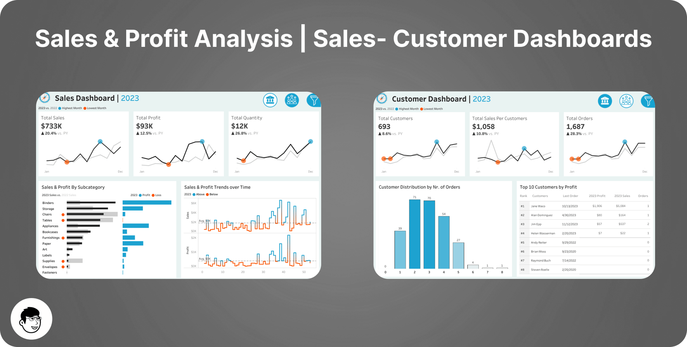

# Sales & Profit Analysis Dashboard | MySQL + Tableau

**Tools:** MySQL, Tableau, Figma
**Published:** July 19, 2024
**Skills:** analytical approach
[](https://public.tableau.com/views/SalesProfitAnalysis_Sales-CustomerDashboards/CustomerDashboard)

## The question

What would sales managers and executives actually use, rather than a dashboard for the sake of having one? Sales performance and customer behavior are different questions, so I built two separate dashboards instead of cramming both into one view.

## The data

A MySQL `sales` database: 148,395 transactions across 338 products, 38 customers and 15 markets, from October 2017 to June 2020 (2020 is a partial year). Schema, quirks and import steps are in [`data/README.md`](data/README.md).

## The approach

1. **Explore in SQL.** Customer counts, market-level transactions, currency checks and revenue by year, month and market. See [`analysis/sales_queries.sql`](analysis/sales_queries.sql).
2. **Sales dashboard.** A KPI overview first (total sales, profit, quantity, current year against previous), because nothing means anything without a comparison point. Then monthly trends with the highest and lowest months highlighted, product subcategories compared on sales and profit for current versus previous year, and weekly sales and profit trends with average lines so good weeks stand out from weeks that only looked fine next to a bad one.
3. **Customer dashboard.** Total customers, sales per customer and order counts, year over year. Monthly trends with the same highest and lowest highlighting, a distribution of how many orders customers place (loyalty is invisible in a single average), and a Top 10 customers by profit table with rank, order count, current sales and profit, and last order date: the thing an account manager opens before a client call.
4. **Make it interactive.** Jump between years and between the two views, click a bar to filter the whole page, and filter by product category and subcategory plus region, state and city.

The Tableau workbook is in [`analysis/Sales_Analysis_Project.twb`](analysis/Sales_Analysis_Project.twb).

## What the data shows

Revenue is in INR (the two USD rows are ignored here). Profit is the sum of `profit_margin`.

**Sales are shrinking while margin is thin.**

| Period | Revenue | Profit | Margin |
|---|---|---|---|
| 2017 (Oct to Dec) | ₹92.9M | ₹2.8M | 3.0% |
| 2018 | ₹413.7M | ₹9.3M | 2.3% |
| 2019 | ₹336.0M | ₹10.5M | 3.1% |
| 2020 (to 26 Jun) | ₹142.2M | ₹2.1M | 1.4% |

2020 has only half a year, so compare like for like: January to June revenue went from ₹218.7M (2018) to ₹168.0M (2019) to ₹142.2M (2020). Revenue fell in 2019 yet profit rose, because margin improved from 2.3% to 3.1%. In 2020 it dropped to 1.4%.

**Revenue is concentrated.**
- **Market:** Delhi NCR is 53% of all revenue (₹519.5M), then Mumbai (₹150.1M) and Ahmedabad (₹132.3M).
- **Customer:** one customer, Electricalsara Stores, accounts for 42% of revenue (₹413.3M) and 38% of profit. The next largest is ₹49.6M.
- **Channel:** Brick & Mortar brings in 76% of revenue, but E-Commerce earns a better margin (3.5% versus 2.2%).
- **Brand:** among the ₹516M of sales whose product exists in the `products` table, Own Brand is 72% and earns a 2.6% margin versus 2.0% for Distribution. Note that 59 of the 338 product codes in `transactions` (₹469M of revenue) are missing from `products`, so any product-type view is incomplete.

**Some markets and products lose money.** Kanpur (₹13.6M revenue) and Bengaluru (₹0.4M) are both loss-making overall, and Hyderabad barely breaks even. At product level, 107 of the 338 products sold made a net loss.

**Peak month:** January 2018 (₹42.5M). Chennai, the market the SQL examples focus on, is small (₹18.0M, 1.8% of revenue) with a 1.7% margin.

*These figures were recomputed from the dump to check the write-up and are not read off the Tableau views.*

## Repository structure

```
sales-profit-analysis/
├── README.md
├── data/
│   ├── README.md                 schema, import steps, known quirks
│   └── db_dump.sql               MySQL dump of the sales database
├── analysis/
│   ├── sales_queries.sql         SQL exploration queries
│   └── Sales_Analysis_Project.twb  Tableau workbook
└── output/
    └── README.md                 link to the live dashboard (add screenshots here)
```

## How to reproduce

1. Import `data/db_dump.sql` into MySQL (see `data/README.md`).
2. Run the queries in `analysis/sales_queries.sql`.
3. Open `analysis/Sales_Analysis_Project.twb` in Tableau and point the MySQL connection at your local `sales` database.

## Acknowledgements

Built while following [this tutorial playlist](https://youtube.com/playlist?list=PLeo1K3hjS3usDI9XeUgjNZs6VnE0meBrL).
