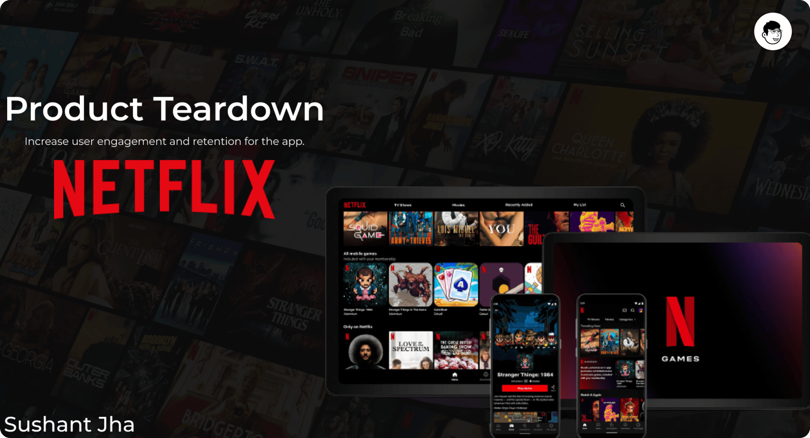

# Netflix Product Teardown

A product teardown of Netflix, framed around one problem statement: **increase user engagement and retention for the app.**

**Deliverable:** [`analysis/NETFLIX_Product_Teardown.pdf`](analysis/NETFLIX_Product_Teardown.pdf)



## The question

"Increase engagement and retention" sounds like one problem but is really three that don't solve each other: getting people to watch more, getting them to stay subscribed, and staying ahead of competitors long enough for either to matter. Where are the gaps, and what should be built first?

## The approach

1. **Overview.** Business model, revenue streams, mission, USP, key statistics and company timeline (1997 to 2021).
2. **Competitive landscape.** Compared Prime Video, Disney+ Hotstar, ZEE5, JioCinema and YouTube on users, market share, strengths, challenges, and the opportunity each leaves for Netflix.
3. **User personas.** Three archetypes with pain points and needs: a teenage anime lover, a mid-age cinema lover who binge-watches, and a young professional who streams on her commute.
4. **User journey.** Mapped how people discover Netflix (app store, Google, YouTube, influencers, referrals) and the 10-step web sign-up and onboarding flow.
5. **Solutions.** Five solution areas, each with specific features.
6. **Metrics.** Three success metrics per solution area.
7. **Prioritization.** Plotted every feature on an effort vs impact matrix.

## What I found

**Where the gaps are**
- Personas converge on three pain points: recommendations that miss their interests, content that disappears or is incomplete, and friction in the viewing experience (buffering, interruptions, limited time to browse).
- A sample of Play Store reviews backs this up: weak search, titles that don't show up, and shows split across platforms.
- Competitors win on things Netflix can't match with a catalog alone: telecom bundles (Hotstar, JioCinema), ecosystem perks (Prime), live sports and regional content.

**Proposed solutions**

| Area | Features |
|------|----------|
| Personalized recommendations | Enhanced algorithms, curated daily/weekly playlists |
| Interactive and social | Watch parties, social sharing |
| Enhanced experience | Smart downloads, improved UI/UX, multi-device integration |
| Exclusive and interactive content | Interactive storytelling, behind-the-scenes content |
| Retention | Flexible subscriptions (ad-supported, pay-per-view), re-engagement campaigns |

**What to build first**
- **Quick wins (low effort, high impact):** curated playlists and social sharing.
- **Cheap and worthwhile:** smart downloads, behind-the-scenes content, flexible subscriptions, retention campaigns.
- **Big bets (high effort):** enhanced algorithms, watch parties, UI/UX, multi-device integration and interactive storytelling. Interactive storytelling and multi-device integration sit furthest toward high impact.

**How success would be measured:** engagement and time on platform, satisfaction scores and app rating, co-viewing and sharing, content completion rate, churn, and renewal rate.

## Limitations

- Desk research from public sources, with no primary user research; personas are illustrative.
- Effort and impact placements are judgment calls, not estimates from engineering or data.
- Statistics are as of the deck's publication date.

## Project structure

```
netflix-product-teardown/
├── README.md      the question, the approach, what I found
├── data/          sources and notes (no raw dataset)
├── analysis/      the teardown deck (PDF)
└── output/        cover image
```
---
*If you find any errors, feel free to email me at [sushant.kr.jha02@gmail.com](mailto:@sushant.kr.jha02@gmail.com).*
